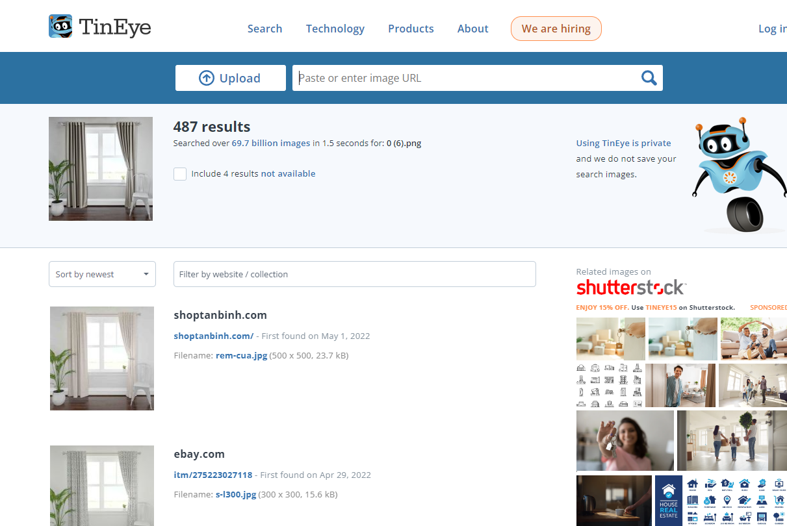

# MemBench: Memorized Image Trigger Prompt Dataset for Diffusion Models

## Prerequisites

To run the experiments, set up the environment using the following command:

```bash
pip install -r requirements.txt
```

### SSCD Model Download Instructions

To download the SSCD model, please download it from the following link and place it in the current folder:
https://dl.fbaipublicfiles.com/sscd-copy-detection/sscd_disc_large.torchscript.pt

### COCO Dataset Download Instructions

For the general prompt scenario, the prompts from the COCO 2017 validation set need to be downloaded. The official website is [https://cocodataset.org/#home](https://cocodataset.org/#home), but as of our last check, downloading directly from the site was not available. Therefore, it is recommended to use the [FiftyOne library](https://docs.voxel51.com/). 

However, note that the caption annotation data may not be included in the FiftyOne library. As an alternative, you can download the `annotations_trainval2017/annotations/captions_val2017.json` file from [this Kaggle dataset](https://www.kaggle.com/datasets/nikhil7280/coco-image-caption?resource=download) and place it in the main folder of your project.


## Memorized Image Trigger Prompt Search (Algorithm 1)

To run the experiments, run the following codes:
```bash
python run_MCMC.py --device cuda --num_iterations 150 --order random
```

### Folder Structure
After running sufficient experiments, you can check the sel_images folder within exps_generation/demo_{date}_random_approx1_len8_topk200_sdtemp_0.1_sdth_0. Inside, you will find memorized image candidates organized as follows:
```
exps_generation
└── demo_{date}_random_approx1_len8_topk200_sdtemp_0.1_sdth_0
    └── sel_images
        ├── 0009.1172
        │   └── 0
        │       ├── 0.png
        │       ├── 1.png
        │       └── ...
        ├── 0012.6484
        │   ├── 0
        │   ├── 1
        │   └── 2
        └── ...
```
* The values inside the sel_images folder (e.g., 0009.1172, 0012.6484, etc.) represent the $D_\theta$ values of the discovered candidate prompts.
* The subfolders (e.g., 0, 1, 2, etc.) represent clusters.
* The images within these clusters are the memorized image candidates.

### Tineye Reverse Image Search

0009.1172 folder contains an image named `0.png`, as shown below:


Upload this image to the following website:

[https://tineye.com/how](https://tineye.com/how)

This allows us to search for similar images on the web. See the image below:



### Note
There can be many failure cases. Therefore, to obtain meaningful results, please run the algorithm for an extended period (approximately one day). After sufficient time has passed, check the images inside the `sel_images` folder and verify them using a reverse image search API.

## Memorized Image Trigger Prompt Augmentation (Algorithm 2)

To run the experiments, run the following codes:
```bash
python run_MCMC.py --SD_temperature 1.5 --num_iterations 50 --threshold 3 --num_samples 1 --order aug --init_sentence 'the no limits business woman podcast'
```

Afterward, a pickle file named `demo_{date}_aug_approx1_len10_topk200_sdtemp_1.5_sdth_3.0/000000.pickle` will be generated. This pickle file contains a Python dictionary structured as follows:
- The key represents the number of words that have been changed (including their positions) from the original sentence (e.g., "the no limits business woman podcast").
- The value is another dictionary, where sentences with the specified number of word changes are stored along with their corresponding $D_\theta$ values.

For example:

```python
import pickle
with open('demo_{date}_aug_approx1_len10_topk200_sdtemp_1.5_sdth_3.0/000000.pickle', 'rb') as f:
    res = pickle.load(f)
print(res[5])
```
output:
```arduino
{'nom company business podcast': 6.09765625, 'no excuse company business podcast': 26.734375, 'no minded company business podcast': 5.734375, 'no excuse personal business podcast': 5.9609375, 'no excuses personal business podcast': 10.9921875, 'no without personal business podcast': 10.0859375, 'no frontiers personal business podcast': 5.20703125}
```
In this example, if you generate an image using the sentence "no excuse company business podcast," (SD 1.4, DDIM Scheduler) you will find that it produces the same memorized image as "the no limits business woman podcast."

```python
from diffusers import StableDiffusionPipeline, DDIMScheduler
import torch
pipe = StableDiffusionPipeline.from_pretrained('CompVis/stable-diffusion-v1-4', torch_dtype = torch.float16, safety_checker = None).to('cuda')
pipe.scheduler = DDIMScheduler.from_config(pipe.scheduler.config)
pipe('the no limits business woman podcast')[0][0].save('origin.png')
pipe('no excuse company business podcast')[0][0].save('augmented.png')
```

output:
|  |  |
|:---------------------------:|:------------------------------:|
| origin.png                  | augmented.png                  |

## Evaluation of Memorization Mitigation Methods

To run the experiments in Stable Diffusion 1, run the following codes:
```bash
## base Stable Diffusion
python run_mitigation.py --save_path exps_mitigation/base
## RTA
python run_mitigation.py --save_path exps_mitigation/RTA --prompt_aug_style rand_token_add
## RNA
python run_mitigation.py --save_path exps_mitigation/RNA --prompt_aug_style rand_num_add
## Wen et al.
python run_mitigation.py --save_path exps_mitigation/Wen --optim_target_loss 5
## Ren et al.
python run_mitigation.py --save_path exps_mitigation/Ren --rescale_attention 1.1
```
To run the experiments in COCO dataset, run the following codes:
```bash
## base Stable Diffusion
python run_mitigation.py --save_path exps_mitigation/base_COCO --dataset COCO
```

## Acknowledgements
- [Detecting, Explaining, and Mitigating Memorization in Diffusion Models
](https://github.com/YuxinWenRick/diffusion_memorization): Helped us to create mitigation codes.
- [Unveiling and Mitigating Memorization in Text-to-image Diffusion Models through Cross Attention](https://github.com/renjie3/memattn): We have cloned this repo to implement Ren's method

## Citation

If you wish to cite this work, please use the following BibTeX entry:

```bibtex
@article{hong2024membenchmemorizedimagetrigger,
      title={MemBench: Memorized Image Trigger Prompt Dataset for Diffusion Models}, 
      author={Chunsan Hong and Tae-Hyun Oh and Minhyuk Sung},
      year={2024},
      journal={arXiv preprint arXiv:2407.17095},
```